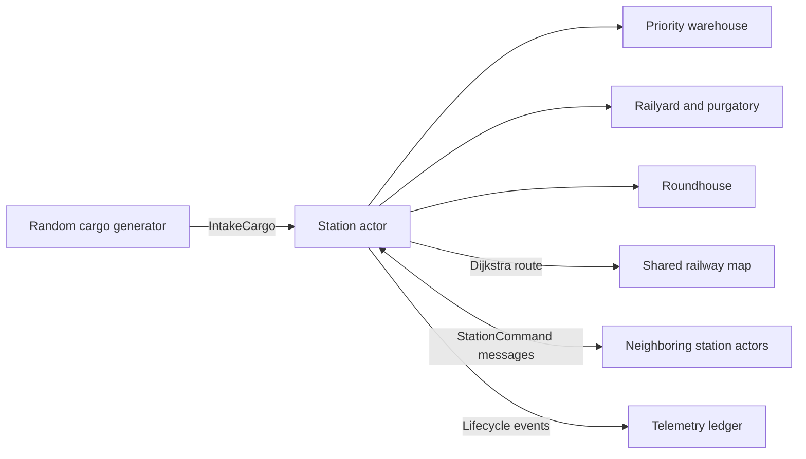

# Hello Thomas 🚂

> A station-centric, asynchronous railway simulation written in Rust.

[](https://www.rust-lang.org/)


Hello Thomas models a small railway network in which autonomous stations route cargo, assemble trains, share scarce engines, and recover from failures. It began as a way to learn Rust's ownership and borrowing rules and has grown into an actor-style concurrency experiment powered by Tokio.

The simulation is intentionally a little chaotic: cargo expires, contraband gets confiscated, engines may need to arrive from another station, and trains can derail. The interesting part is watching the network keep moving.

## Highlights

- **Asynchronous station actors** — every station owns its state and processes commands through a Tokio channel.
- **Shortest-path routing** — trains travel hop by hop along routes selected with Dijkstra's algorithm.
- **Decentralized engine requests** — a station without a suitable engine searches its neighbors with a bounded, fan-out request.
- **Offer/accept handshakes** — requested engines are reserved and transferred without a thundering herd of responders.
- **Deadline-aware cargo scheduling** — warehouse work is prioritized by how close each shipment is to expiring.
- **Ownership-driven rolling stock** — engines, cars, and cargo move between stations as owned Rust values.
- **Failure and recovery paths** — derailments, failed transfers, rejected cars, emergency salvage, and retryable cargo are modeled explicitly.
- **Lifecycle telemetry** — a central ledger tracks deliveries, expirations, purgatory events, derailments, and dispatch failures.
- **Dual logging** — readable `info` output goes to the terminal while detailed `trace` logs are written to disk.

## How it works



At startup, the executable:

1. Loads stations and undirected tracks from `sodor.json`.
2. Starts one asynchronous command loop per station.
3. Seeds each station with engines and randomized cargo.
4. Generates additional cargo every 150 ms for 12 seconds.
5. Lets station heartbeats expire, prioritize, and dispatch pending work.
6. Stops generation and waits up to 45 seconds for the cargo lifecycle to drain.
7. Prints station status and a final telemetry snapshot before shutting down.

Travel time, fuel use, engine capability, cargo lifetime, contraband, and a per-hop derailment chance all influence the result. Cargo decay pauses while a shipment is in transit, and engines refuel when they reach a station.

## Getting started

### Requirements

- A current stable [Rust toolchain](https://www.rust-lang.org/tools/install) with Rust 2024 edition support
- Cargo, installed with Rust

### Run the simulation

```bash
git clone https://github.com/oballent/hello_thomas.git
cd hello_thomas
cargo run --release
```

Run the command from the repository root because the executable reads `sodor.json` from the current working directory.

Each run is randomized, so routes may be the same but cargo, engine requests, delivery outcomes, and failures will vary. The program runs for at least 12 seconds and may spend up to another 45 seconds draining active cargo.

## Configure the railway

Edit `sodor.json` to change the network:

```json
{
  "stations": [
    { "id": 0, "name": "Tidmouth", "x": 0.0, "y": 0.0 },
    { "id": 1, "name": "Knapford", "x": 200.0, "y": -50.0 }
  ],
  "tracks": [
    { "origin": 0, "destination": 1 }
  ]
}
```

Station IDs must be unique, and every track endpoint must refer to a declared station. Track distance is calculated from the stations' Cartesian coordinates. Tracks are treated as bidirectional even though each pair is listed only once.

Engine loadouts, cargo generation, simulation duration, heartbeat timing, and failure probabilities currently live in the Rust source rather than in the JSON configuration.

## Logs and output

The terminal shows `info`-level activity and a colored status report for each station. More detailed trace output is written to a daily log beneath `target/` with the `hello_thomas.log` prefix.

The final `TelemetrySnapshot` reports values such as:

- cargo registered, delivered, failed, and still active;
- cargo expired in a warehouse, in purgatory, or in transit;
- cargo sent to purgatory;
- trains derailed or unable to dispatch/forward; and
- emergency SOS failures.

## Project structure

| Path | Purpose |
| --- | --- |
| `src/main.rs` | Builds the world, seeds the simulation, runs the cargo generator, and coordinates shutdown. |
| `src/facilities.rs` | Implements station actors, warehouses, roundhouses, railyards, dispatch, engine sharing, and recovery. |
| `src/models.rs` | Defines cargo, engines, trains, cars, commands, reports, errors, and fuel/travel behavior. |
| `src/network.rs` | Stores the railway graph, finds shortest paths, and maintains the telemetry ledger. |
| `sodor.json` | Active station and track configuration loaded at runtime. |
| `seed.json` | Earlier sample seed data retained for reference; the current executable does not load it. |

## Development

Check that the project builds with the locked dependency versions:

```bash
cargo check --locked
```

Useful additional checks:

```bash
cargo clippy --all-targets --all-features --locked
```

The project currently builds successfully, though the compiler and Clippy report warnings from experiments, planned paths, and formatting still in progress. There is not yet an automated test suite.

## Project status

Hello Thomas is an experimental learning project rather than a finished game or production simulator. Natural next stops include deterministic simulation seeds, automated tests, externalized runtime settings, richer metrics, and further separation between the simulation library and executable.

The original mission still applies:

- master Rust's ownership and borrowing rules;
- find and fix delightfully devious logic errors; and
- explore types, enums, message passing, and asynchronous system design.

> Either you're a Thomas, or you're a Diesel... or somewhere in between.

This is an unofficial educational project and is not affiliated with or endorsed by the owners of Thomas & Friends.
